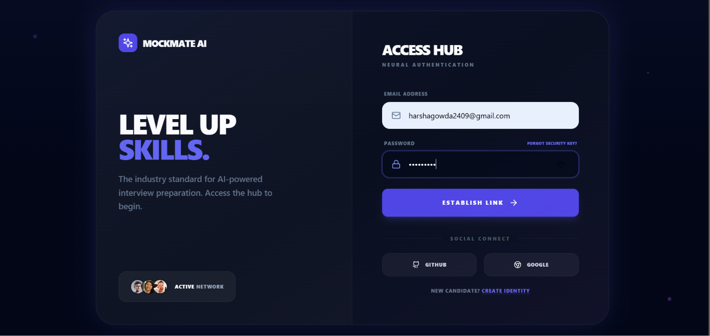
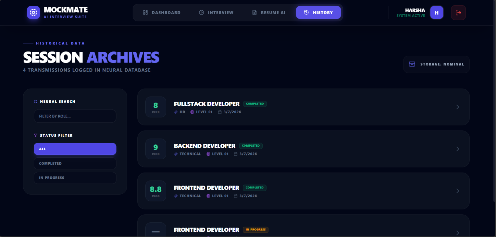

<p align="center">
  
</p><div align="center">
 <div align="center">

# 🚀 MockMate – AI Mock Interview Platform (Backend)

Backend service for an AI-powered Mock Interview Platform built using **Java Spring Boot**, **Spring Security**, and **MongoDB**.


</div>

---

# 📖 Project Overview

MockMate is an AI-powered mock interview platform designed to help users prepare for technical interviews. The platform enables users to practice interview questions, receive AI-generated feedback, analyze resumes, and monitor their interview performance through a modern web interface.
---
# 🚀 Project Highlights

- 🤖 AI-powered interview question generation
- 📄 Resume analysis
- 🔐 Secure JWT authentication
- 📊 Interview performance dashboard
- 💬 AI-generated answer evaluation
- 📱 Responsive modern interface
- ⚡ RESTful API architecture
- 🗄️ MongoDB database integration
- 
# ✨ Features

- User Authentication (JWT)
- Login & Registration
- Resume Upload & Analysis
- AI Generated Interview Questions
- AI Answer Evaluation
- Dashboard APIs
- Interview History
- Profile Management
- REST APIs
- Spring Security

---

# 🛠️ Tech Stack

- Java 17
- Spring Boot
- Spring Security
- Maven
- MongoDB
- JWT Authentication
- REST API
- Groq AI

---

# 📂 Project Structure

<pre> # 🏗️ Project Architecture ```text User │ ▼ React Frontend │ REST API Calls │ ▼ Spring Boot Backend │ JWT Authentication │ ▼ MongoDB │ ▼ Groq AI API ``` </pre>

# ⚙️ Installation

```bash
git clone https://github.com/harshagowda2409-bit/MockMate-your-interview-partner.git

cd MockMate-your-interview-partner

mvn clean install

mvn spring-boot:run
```

---

# 📡 API Modules

- Authentication
- Interview
- Resume
- User
- Dashboard

---

# 📌 Future Enhancements

- Voice Interviews
- Video Interviews
- AI Performance Reports
- Email Notifications
- Admin Dashboard

---
# 📸 Screenshots

## Home Page



---

## Dashboard


---

## Interview


---

## AI Feedback



# 💻 Frontend Repository

https://github.com/harshagowda2409-bit/MockMate-your-interview-partner-frontend

---

## 👨‍💻 Developer

**Harsha N U**

Information Science & Engineering

AMC Engineering College
